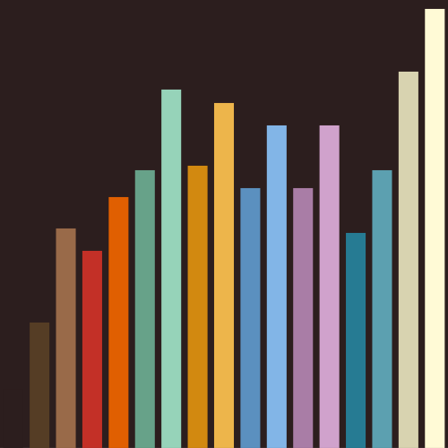
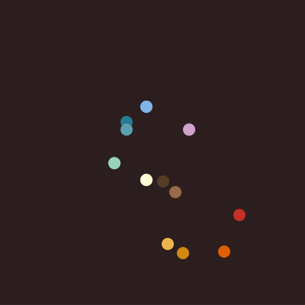
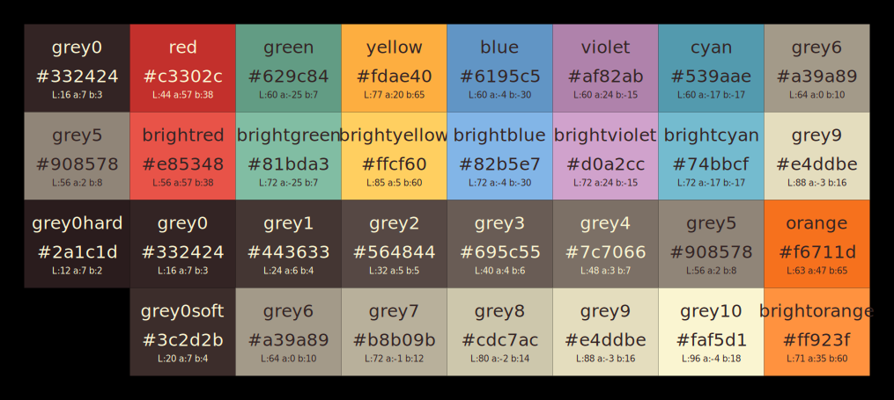
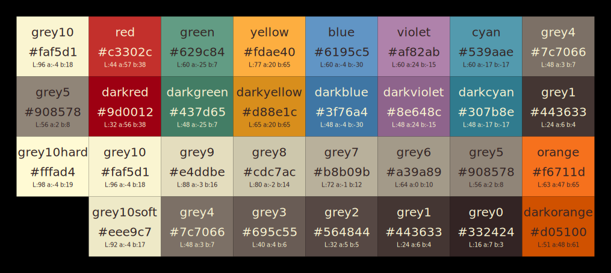
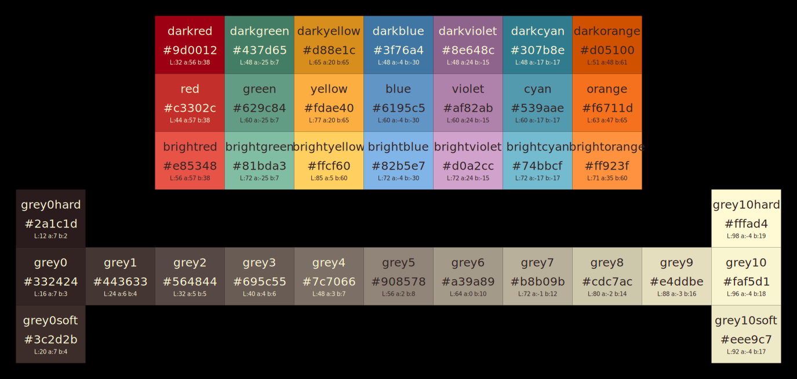

# VOGEL5000

A colour scheme inspired by Joe Bergantine's [Birds of Paradise](https://github.com/bergantine/Birds-of-Paradise).

## 17 Colour Version

This first version has 17 unique colours.  My target for this palette was an .Xresources file which has 16 colours plus foreground, background and cursor colours.  For foreground and cursor I used the regular white from the palette.  The background colour is the "extra" 17th colour.

The colours are fairly balanced in terms of their [CIELAB](https://en.wikipedia.org/wiki/CIELAB_color_space) values.

### Values

All of the conversions between RGB (hex) and CIELAB values have been performed with the [color-convert](https://github.com/Qix-/color-convert) JavaScript library.

Term Colour | Hex  | Lightness  | a* (G-R)  | b* (B-Y)  | Red  | Green  | Blue
--- | --- | --- | --- | --- | --- | --- | ---
background | #2C1E1E  | 13  | 7  | 3  | 44  | 30  | 30
black | #553D25  | 28  | 7  | 19  | 85  | 61  | 37
bright black | #996A49  | 49  | 15  | 26  | 153  | 106  | 73
red | #C33027  | 44  | 57  | 41  | 195  | 48  | 39
bright red | #E05F01  | 56  | 47  | 65  | 224  | 95  | 1
green | #67A289  | 62  | -25  | 7  | 103  | 162  | 137
bright green | #96D3B9  | 80  | -25  | 7  | 150  | 211  | 185
yellow | #D28910  | 63  | 20  | 66  | 210  | 137  | 16
bright yellow | #EDB54B  | 77  | 10  | 60  | 237  | 181  | 75
blue | #5B90BF  | 58  | -4  | -30  | 91  | 144  | 191
bright blue | #82B5E7  | 72  | -4  | -30  | 130  | 181  | 231
magenta | #A97DA6  | 58  | 24  | -15  | 169  | 125  | 166
bright magenta | #D0A2CC  | 72  | 24  | -15  | 208  | 162  | 204
cyan | #267B93  | 48  | -17  | -20  | 38  | 123  | 147
bright cyan | #5CA0B0  | 62  | -17  | -15  | 92  | 160  | 176
white | #D8D3B0  | 84  | -4  | 18  | 216  | 211  | 176
bright white | #FFFAD6  | 98  | -4  | 18  | 255  | 250  | 214

#### Lightness

This graph shows the relative lightness values.

#### a* and b* Values

This graph shows the relative a* and b* values.  The x-axis shows the a* values (red on the left, green on the right) and the y-axis shows the b* values (blue at the top, yellow at the bottom.)

## 36 Colour Version

This version uses 36 colours because that's what [gruvbox](https://github.com/morhetz/gruvbox) uses.  This way I can take gruvbox themes and map them into being Vogel5000 themes.

For comparison, here are some swatches laid out in the same way as the gruvbox ones.

